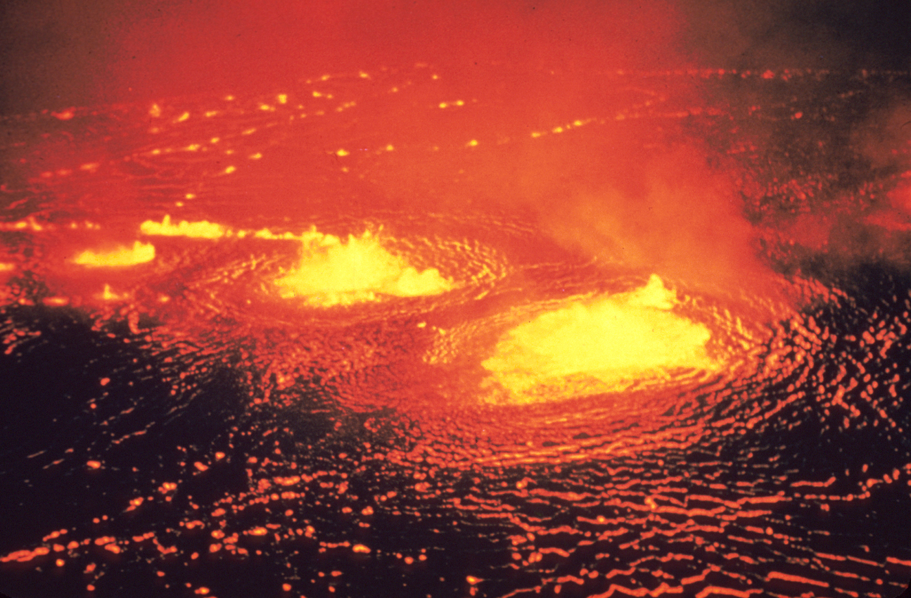
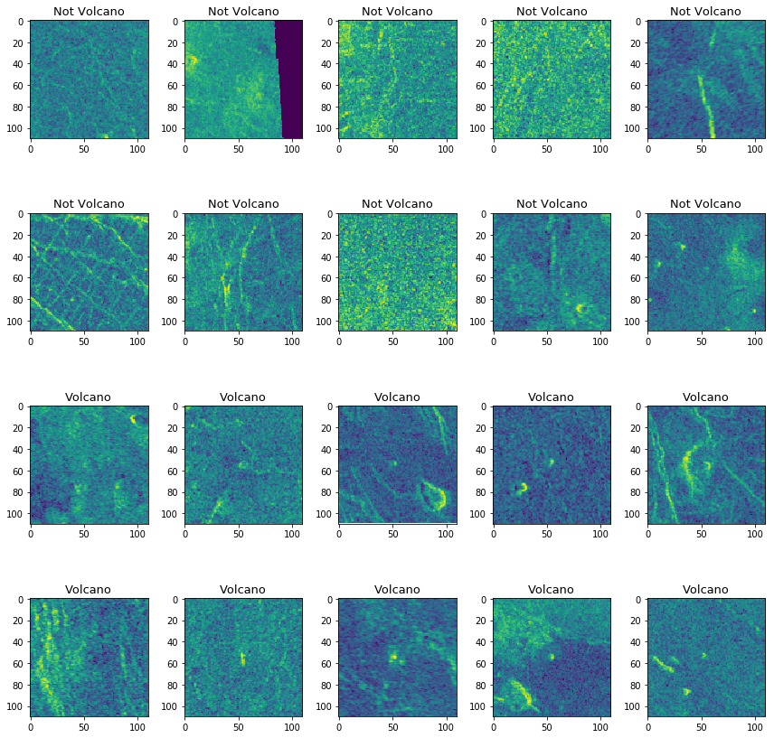

This Work Originally Published on [Kaggle](https://www.kaggle.com/behcetsenturk/finding-volcanoes-with-cnn).



# **Finding Volcanoes with CNN** <a id="0"></a> <br>

### Hello in this kernel we will try to classify the Magellan's Venus images and find the volcanoes with CNN.
#### **Content:**
* 1-[Load and Exploring the Data](#1)
    * a-[Fixing the Data](#2)
    * b-[Volcanoes With Graphs](#3)
* 2-[Print the Images](#4)
* 3-[The First Step to the CNN](#5)
    * a-[Prepare the Data for the CNN](#6)
    * b-[Building the First Model](#7)
    * c-[Train Our First Model](#8)
* 4-[Clearing the Data and Adding Dropouts](#9)
    * a-[Clearing the Data From Blank Images](#10)
    * b-[Building Improved Model With Dropouts](#11)
* 5-[Improving the Accuracy](#12)
    * a-[Image Data Generator](#13)
    * b-[More Layers and New Hyperparams](#14)
* 6-[Conclusion](#15)


## 1-Load and Exploring the Data [^](#0) <a id="1"></a> <br>
We have a lot of images which taken by Magellan spacecraft from Venus. Some of them belong to Venus volcanoes and our main task is the classification of them.

Okay let's start with load the data.


```python
import numpy as np # linear algebra
import pandas as pd # data processing, CSV file I/O (e.g. pd.read_csv)

import os
print(os.listdir("../input"))

X_train = pd.read_csv('../input/volcanoes_train/train_images.csv')
y_train = pd.read_csv('../input/volcanoes_train/train_labels.csv')
X_test = pd.read_csv('../input/volcanoes_test/test_images.csv')
y_test = pd.read_csv('../input/volcanoes_test/test_labels.csv')
```

    ['Volcanoes_train', 'volcanoes_test', 'Volcanoes_test', 'volcanoes_train']


```python
X_train.head()
```


<div>
<style scoped>
    .dataframe tbody tr th:only-of-type {
        vertical-align: middle;
    }

    .dataframe tbody tr th {
        vertical-align: top;
    }

    .dataframe thead th {
        text-align: right;
    }
</style>
<table border="1" class="dataframe">
  <thead>
    <tr style="text-align: right;">
      <th></th>
      <th>95</th>
      <th>101</th>
      <th>99</th>
      <th>103</th>
      <th>95.1</th>
      <th>86</th>
      <th>96</th>
      <th>89</th>
      <th>70</th>
      <th>104</th>
      <th>115</th>
      <th>96.1</th>
      <th>89.1</th>
      <th>102</th>
      <th>109</th>
      <th>108</th>
      <th>102.1</th>
      <th>104.1</th>
      <th>95.2</th>
      <th>91</th>
      <th>100</th>
      <th>99.1</th>
      <th>97</th>
      <th>100.1</th>
      <th>107</th>
      <th>109.1</th>
      <th>98</th>
      <th>98.1</th>
      <th>94</th>
      <th>98.2</th>
      <th>102.2</th>
      <th>87</th>
      <th>82</th>
      <th>94.1</th>
      <th>105</th>
      <th>93</th>
      <th>102.3</th>
      <th>107.1</th>
      <th>98.3</th>
      <th>105.1</th>
      <th>...</th>
      <th>101.417</th>
      <th>95.420</th>
      <th>105.363</th>
      <th>103.377</th>
      <th>74.49</th>
      <th>88.287</th>
      <th>106.348</th>
      <th>111.212</th>
      <th>90.324</th>
      <th>96.422</th>
      <th>101.418</th>
      <th>90.325</th>
      <th>97.425</th>
      <th>102.435</th>
      <th>97.426</th>
      <th>106.349</th>
      <th>108.284</th>
      <th>107.327</th>
      <th>93.359</th>
      <th>74.50</th>
      <th>106.350</th>
      <th>115.129</th>
      <th>107.328</th>
      <th>102.436</th>
      <th>91.347</th>
      <th>103.378</th>
      <th>111.213</th>
      <th>105.364</th>
      <th>116.102</th>
      <th>117.111</th>
      <th>111.214</th>
      <th>107.329</th>
      <th>92.354</th>
      <th>89.258</th>
      <th>103.379</th>
      <th>99.414</th>
      <th>117.112</th>
      <th>116.103</th>
      <th>118.82</th>
      <th>96.423</th>
    </tr>
  </thead>
  <tbody>
    <tr>
      <th>0</th>
      <td>91</td>
      <td>92</td>
      <td>91</td>
      <td>89</td>
      <td>92</td>
      <td>93</td>
      <td>96</td>
      <td>101</td>
      <td>107</td>
      <td>104</td>
      <td>92</td>
      <td>81</td>
      <td>76</td>
      <td>83</td>
      <td>88</td>
      <td>93</td>
      <td>91</td>
      <td>92</td>
      <td>93</td>
      <td>90</td>
      <td>83</td>
      <td>81</td>
      <td>79</td>
      <td>84</td>
      <td>86</td>
      <td>87</td>
      <td>92</td>
      <td>93</td>
      <td>94</td>
      <td>94</td>
      <td>87</td>
      <td>83</td>
      <td>95</td>
      <td>96</td>
      <td>94</td>
      <td>91</td>
      <td>93</td>
      <td>96</td>
      <td>93</td>
      <td>87</td>
      <td>...</td>
      <td>95</td>
      <td>91</td>
      <td>91</td>
      <td>89</td>
      <td>88</td>
      <td>90</td>
      <td>88</td>
      <td>93</td>
      <td>95</td>
      <td>106</td>
      <td>113</td>
      <td>116</td>
      <td>108</td>
      <td>94</td>
      <td>92</td>
      <td>96</td>
      <td>99</td>
      <td>92</td>
      <td>87</td>
      <td>89</td>
      <td>105</td>
      <td>119</td>
      <td>121</td>
      <td>116</td>
      <td>111</td>
      <td>113</td>
      <td>112</td>
      <td>103</td>
      <td>101</td>
      <td>103</td>
      <td>103</td>
      <td>92</td>
      <td>93</td>
      <td>95</td>
      <td>98</td>
      <td>105</td>
      <td>104</td>
      <td>100</td>
      <td>90</td>
      <td>81</td>
    </tr>
    <tr>
      <th>1</th>
      <td>87</td>
      <td>70</td>
      <td>72</td>
      <td>74</td>
      <td>84</td>
      <td>78</td>
      <td>93</td>
      <td>104</td>
      <td>106</td>
      <td>106</td>
      <td>94</td>
      <td>79</td>
      <td>96</td>
      <td>88</td>
      <td>86</td>
      <td>89</td>
      <td>98</td>
      <td>94</td>
      <td>76</td>
      <td>78</td>
      <td>91</td>
      <td>96</td>
      <td>86</td>
      <td>71</td>
      <td>82</td>
      <td>76</td>
      <td>72</td>
      <td>81</td>
      <td>90</td>
      <td>84</td>
      <td>81</td>
      <td>70</td>
      <td>75</td>
      <td>91</td>
      <td>81</td>
      <td>81</td>
      <td>92</td>
      <td>94</td>
      <td>79</td>
      <td>97</td>
      <td>...</td>
      <td>86</td>
      <td>80</td>
      <td>83</td>
      <td>93</td>
      <td>94</td>
      <td>91</td>
      <td>90</td>
      <td>94</td>
      <td>96</td>
      <td>78</td>
      <td>88</td>
      <td>95</td>
      <td>121</td>
      <td>108</td>
      <td>88</td>
      <td>87</td>
      <td>89</td>
      <td>100</td>
      <td>99</td>
      <td>88</td>
      <td>107</td>
      <td>108</td>
      <td>101</td>
      <td>88</td>
      <td>95</td>
      <td>81</td>
      <td>57</td>
      <td>84</td>
      <td>89</td>
      <td>92</td>
      <td>84</td>
      <td>71</td>
      <td>95</td>
      <td>102</td>
      <td>94</td>
      <td>80</td>
      <td>91</td>
      <td>80</td>
      <td>84</td>
      <td>90</td>
    </tr>
    <tr>
      <th>2</th>
      <td>0</td>
      <td>0</td>
      <td>0</td>
      <td>0</td>
      <td>0</td>
      <td>0</td>
      <td>0</td>
      <td>0</td>
      <td>0</td>
      <td>0</td>
      <td>0</td>
      <td>0</td>
      <td>0</td>
      <td>0</td>
      <td>0</td>
      <td>0</td>
      <td>0</td>
      <td>0</td>
      <td>0</td>
      <td>0</td>
      <td>0</td>
      <td>0</td>
      <td>0</td>
      <td>0</td>
      <td>0</td>
      <td>0</td>
      <td>0</td>
      <td>0</td>
      <td>0</td>
      <td>0</td>
      <td>0</td>
      <td>0</td>
      <td>0</td>
      <td>0</td>
      <td>0</td>
      <td>0</td>
      <td>0</td>
      <td>0</td>
      <td>0</td>
      <td>0</td>
      <td>...</td>
      <td>101</td>
      <td>114</td>
      <td>104</td>
      <td>103</td>
      <td>81</td>
      <td>94</td>
      <td>108</td>
      <td>96</td>
      <td>79</td>
      <td>113</td>
      <td>113</td>
      <td>114</td>
      <td>112</td>
      <td>107</td>
      <td>110</td>
      <td>112</td>
      <td>98</td>
      <td>76</td>
      <td>84</td>
      <td>97</td>
      <td>99</td>
      <td>95</td>
      <td>68</td>
      <td>97</td>
      <td>91</td>
      <td>97</td>
      <td>96</td>
      <td>83</td>
      <td>100</td>
      <td>106</td>
      <td>94</td>
      <td>81</td>
      <td>89</td>
      <td>84</td>
      <td>80</td>
      <td>90</td>
      <td>92</td>
      <td>80</td>
      <td>88</td>
      <td>96</td>
    </tr>
    <tr>
      <th>3</th>
      <td>114</td>
      <td>118</td>
      <td>124</td>
      <td>119</td>
      <td>95</td>
      <td>118</td>
      <td>105</td>
      <td>116</td>
      <td>123</td>
      <td>112</td>
      <td>110</td>
      <td>113</td>
      <td>119</td>
      <td>112</td>
      <td>105</td>
      <td>121</td>
      <td>117</td>
      <td>125</td>
      <td>136</td>
      <td>141</td>
      <td>120</td>
      <td>120</td>
      <td>129</td>
      <td>135</td>
      <td>132</td>
      <td>124</td>
      <td>109</td>
      <td>126</td>
      <td>113</td>
      <td>110</td>
      <td>106</td>
      <td>107</td>
      <td>113</td>
      <td>116</td>
      <td>123</td>
      <td>101</td>
      <td>99</td>
      <td>89</td>
      <td>81</td>
      <td>101</td>
      <td>...</td>
      <td>105</td>
      <td>116</td>
      <td>114</td>
      <td>103</td>
      <td>114</td>
      <td>109</td>
      <td>113</td>
      <td>126</td>
      <td>110</td>
      <td>84</td>
      <td>92</td>
      <td>111</td>
      <td>114</td>
      <td>125</td>
      <td>122</td>
      <td>109</td>
      <td>113</td>
      <td>111</td>
      <td>121</td>
      <td>119</td>
      <td>103</td>
      <td>114</td>
      <td>118</td>
      <td>118</td>
      <td>108</td>
      <td>111</td>
      <td>109</td>
      <td>100</td>
      <td>101</td>
      <td>105</td>
      <td>116</td>
      <td>113</td>
      <td>102</td>
      <td>93</td>
      <td>109</td>
      <td>104</td>
      <td>106</td>
      <td>117</td>
      <td>111</td>
      <td>115</td>
    </tr>
    <tr>
      <th>4</th>
      <td>79</td>
      <td>95</td>
      <td>90</td>
      <td>82</td>
      <td>73</td>
      <td>74</td>
      <td>77</td>
      <td>75</td>
      <td>82</td>
      <td>87</td>
      <td>84</td>
      <td>81</td>
      <td>83</td>
      <td>69</td>
      <td>72</td>
      <td>84</td>
      <td>93</td>
      <td>84</td>
      <td>89</td>
      <td>83</td>
      <td>86</td>
      <td>89</td>
      <td>95</td>
      <td>94</td>
      <td>82</td>
      <td>80</td>
      <td>96</td>
      <td>96</td>
      <td>89</td>
      <td>86</td>
      <td>93</td>
      <td>88</td>
      <td>82</td>
      <td>70</td>
      <td>76</td>
      <td>84</td>
      <td>82</td>
      <td>59</td>
      <td>81</td>
      <td>101</td>
      <td>...</td>
      <td>94</td>
      <td>78</td>
      <td>73</td>
      <td>91</td>
      <td>94</td>
      <td>90</td>
      <td>81</td>
      <td>80</td>
      <td>70</td>
      <td>71</td>
      <td>73</td>
      <td>84</td>
      <td>87</td>
      <td>89</td>
      <td>97</td>
      <td>99</td>
      <td>92</td>
      <td>77</td>
      <td>87</td>
      <td>96</td>
      <td>75</td>
      <td>78</td>
      <td>92</td>
      <td>72</td>
      <td>83</td>
      <td>86</td>
      <td>95</td>
      <td>87</td>
      <td>78</td>
      <td>90</td>
      <td>90</td>
      <td>80</td>
      <td>79</td>
      <td>78</td>
      <td>65</td>
      <td>71</td>
      <td>62</td>
      <td>97</td>
      <td>89</td>
      <td>73</td>
    </tr>
  </tbody>
</table>
</div>


```python
y_train.head()
```


<div>
<style scoped>
    .dataframe tbody tr th:only-of-type {
        vertical-align: middle;
    }

    .dataframe tbody tr th {
        vertical-align: top;
    }

    .dataframe thead th {
        text-align: right;
    }
</style>
<table border="1" class="dataframe">
  <thead>
    <tr style="text-align: right;">
      <th></th>
      <th>Volcano?</th>
      <th>Type</th>
      <th>Radius</th>
      <th>Number Volcanoes</th>
    </tr>
  </thead>
  <tbody>
    <tr>
      <th>0</th>
      <td>1</td>
      <td>3.0</td>
      <td>17.46</td>
      <td>1.0</td>
    </tr>
    <tr>
      <th>1</th>
      <td>0</td>
      <td>NaN</td>
      <td>NaN</td>
      <td>NaN</td>
    </tr>
    <tr>
      <th>2</th>
      <td>0</td>
      <td>NaN</td>
      <td>NaN</td>
      <td>NaN</td>
    </tr>
    <tr>
      <th>3</th>
      <td>0</td>
      <td>NaN</td>
      <td>NaN</td>
      <td>NaN</td>
    </tr>
    <tr>
      <th>4</th>
      <td>0</td>
      <td>NaN</td>
      <td>NaN</td>
      <td>NaN</td>
    </tr>
  </tbody>
</table>
</div>


We have some labels in here. 
According to the dataset information first column tell us that the image has contain valcanoes or not.

Type column has 4 different value these are:
*Type: 1= definitely a volcano,2 =probably, 3= possibly, 4= only a pit is visible*

Radius: is the radius of the volcan in the center of the image, in pixels.

Number Volcanoes: The number of volcanoes in the image.**

So how many samples do we have?


```python
print("X_train ->",X_train.shape,"\ny_train ->",y_train.shape,"\nX_test ->",X_test.shape,"\ny_test ->",y_test.shape)
```

    X_train -> (6999, 12100) 
    y_train -> (7000, 4) 
    X_test -> (2733, 12100) 
    y_test -> (2734, 4)


So we have 6999 flatten images that contain 12100 pixels in train set and 2733 in the test set.  So %28 of the data is test. The ratio is good so I will leave it same.

But we have some big problem here. For train data, we have 6999 images but in labels, we have 7000 labels so there must be one missing image.
### a) Fixing the Data [^](#0) <a id="2"></a> <br>

Actually, if you checked above the X_train.head part you will see clearly that the column names are our missing image's pixels. The problem is the indexing of the X_train and X_test and we must reindex this. 

There is also one more thing that we must solve. The column names are floating points and I don't know why :/ But we can turn them into an integer to use as pixels.


```python
def XFix(X):
    X.loc[-1] = X.columns.values.astype(float).astype(int)  # adding column names as a new row
    X.index = X.index + 1  # shifting index
    X.sort_index(inplace=True)  # sorting the index

XFix(X_train)
XFix(X_test)
```


```python
print("X_train ->",X_train.shape,"\ny_train ->",y_train.shape,"\nX_test ->",X_test.shape,"\ny_test ->",y_test.shape)
```

    X_train -> (7000, 12100) 
    y_train -> (7000, 4) 
    X_test -> (2734, 12100) 
    y_test -> (2734, 4)


Now we solve the problem let's continue.

### b) Volcanoes With Graphs [^](#0) <a id="2"></a> <br>
In this part, we can try to analyze our data's features with our precious graph libraries :)

We can check out the distribution of data with some colored graphs.  I will use plotly for it.


```python
import plotly
from plotly.offline import iplot
from IPython.display import Image
plotly.offline.init_notebook_mode(connected=True)
import plotly.graph_objs as go

y_trainVolcanoCount = y_train[y_train["Volcano?"] == 1].shape[0]
y_testVolcanoCount = y_test[y_test["Volcano?"] == 1].shape[0]

y_trainNotVolcanoCount = y_train[y_train["Volcano?"] == 0].shape[0]
y_testNotVolcanoCount = y_test[y_test["Volcano?"] == 0].shape[0]

x = ['Train', 'Test']
y = [y_trainVolcanoCount, y_testVolcanoCount]
y2 = [y_trainNotVolcanoCount, y_testNotVolcanoCount]

trace1 = go.Bar(
    x=x,
    y=y,
    textposition = 'auto',
    name = 'Volcano',
    marker=dict(
        color='rgb(255,120,0)',
        line=dict(
            color='rgb(8,48,107)',
            width=1.5),
        ),
    opacity=0.6
)

trace2 = go.Bar(
    x=x,
    y=y2,
    textposition = 'auto',
    name = 'Not Volcano',
    marker=dict(
        color='rgb(20,20,20)',
        line=dict(
            color='rgb(8,48,107)',
            width=1.5),
        ),
    opacity=0.6
)

data = [trace1,trace2]

layout = go.Layout(
    title='Train and Test Data Volcanoes Distribution',
)

fig = go.Figure(data=data, layout=layout)

#iplot(fig)
Image(fig.to_image(format="png"))
```


<script type="text/javascript">
window.PlotlyConfig = {MathJaxConfig: 'local'};
if (window.MathJax) {MathJax.Hub.Config({SVG: {font: "STIX-Web"}});}
if (typeof require !== 'undefined') {
require.undef("plotly");
requirejs.config({
    paths: {
        'plotly': ['https://cdn.plot.ly/plotly-latest.min']
    }
});
require(['plotly'], function(Plotly) {
    window._Plotly = Plotly;
});
}
</script>


We can clearly see that our data is unbalanced. I will leave it same for now.

Then let's plot another graph that shows us the Type column distribution.


```python
y_trainTypeDefinitelyCount = y_train[y_train["Type"] == 1].shape[0]
y_testTypeDefinitelyCount = y_test[y_test["Type"] == 1].shape[0]

y_trainTypeProbablyCount = y_train[y_train["Type"] == 2].shape[0]
y_testTypeProbablyCount = y_test[y_test["Type"] == 2].shape[0]

y_trainTypePossiblyCount = y_train[y_train["Type"] == 3].shape[0]
y_testTypePossiblyCount = y_test[y_test["Type"] == 3].shape[0]

y_trainTypePitCount = y_train[y_train["Type"] == 4].shape[0]
y_testTypePitCount = y_test[y_test["Type"] == 4].shape[0]

x = ['Train', 'Test']
y = [y_trainTypeDefinitelyCount, y_testTypeDefinitelyCount]
y2 = [y_trainTypeProbablyCount, y_testTypeProbablyCount]
y3 = [y_trainTypePossiblyCount, y_testTypePossiblyCount]
y4 = [y_trainTypePitCount, y_testTypePitCount]

trace1 = go.Bar(
    x=x,
    y=y,
    textposition = 'auto',
    name = 'Definitely Volcano',
    marker=dict(
        color='rgb(255,0,0)',
        line=dict(
            color='rgb(0,0,0)',
            width=1.5),
        ),
    opacity=0.9
)

trace2 = go.Bar(
    x=x,
    y=y2,
    textposition = 'auto',
    name = 'Probably Volcano',
    marker=dict(
        color='rgb(255,100,0)',
        line=dict(
            color='rgb(100,100,100)',
            width=1.5),
        ),
    opacity=0.7
)

trace3 = go.Bar(
    x=x,
    y=y3,
    textposition = 'auto',
    name = 'Possibly Volcano',
    marker=dict(
        color='rgb(255,240,0)',
        line=dict(
            color='rgb(200,200,200)',
            width=1.5),
        ),
    opacity=0.5
)

trace4 = go.Bar(
    x=x,
    y=y4,
    textposition = 'auto',
    name = 'Only Pit is Visible',
    marker=dict(
        color='rgb(200,200,200)',
        line=dict(
            color='rgb(255,255,255)',
            width=1.5),
        ),
    opacity=0.4
)

data = [trace1,trace2,trace3,trace4]

layout = go.Layout(
    title='Train and Test Data Volcanoes Type Distribution',
)

fig = go.Figure(data=data, layout=layout)

#iplot(fig)
Image(fig.to_image(format="png"))
```


The graph shows us the train and test data balanced but it is sad that we have just 140 images that definitely volcano from nearly 10000 images.

And now I will plot the *Number Volcanoes* column that will gives us the number of volcano in one image.


```python
y_trainNumberVolcanoesOnelyCount = y_train[y_train["Number Volcanoes"] == 1].shape[0]
y_testNumberVolcanoesOneCount = y_test[y_test["Number Volcanoes"] == 1].shape[0]

y_trainNumberVolcanoesTwoCount = y_train[y_train["Number Volcanoes"] == 2].shape[0]
y_testNumberVolcanoesTwoCount = y_test[y_test["Number Volcanoes"] == 2].shape[0]

y_trainNumberVolcanoesThreeCount = y_train[y_train["Number Volcanoes"] == 3].shape[0]
y_testNumberVolcanoesThreeCount = y_test[y_test["Number Volcanoes"] == 3].shape[0]

y_trainNumberVolcanoesFourCount = y_train[y_train["Number Volcanoes"] >= 4].shape[0]
y_testNumberVolcanoesFourCount = y_test[y_test["Number Volcanoes"] >= 4].shape[0]

x = ['Train', 'Test']
y = [y_trainNumberVolcanoesOnelyCount, y_testNumberVolcanoesOneCount]
y2 = [y_trainNumberVolcanoesTwoCount, y_testNumberVolcanoesTwoCount]
y3 = [y_trainNumberVolcanoesThreeCount, y_testNumberVolcanoesThreeCount]
y4 = [y_trainNumberVolcanoesFourCount, y_testNumberVolcanoesFourCount]

trace1 = go.Bar(
    x=x,
    y=y,
    textposition = 'auto',
    name = 'One Volcano',
    marker=dict(
        color='rgb(212,123,231)',
        line=dict(
            color='rgb(0,0,0)',
            width=1.5),
        ),
    opacity=0.9
)

trace2 = go.Bar(
    x=x,
    y=y2,
    textposition = 'auto',
    name = 'Two Volcano',
    marker=dict(
        color='rgb(13,22,11)',
        line=dict(
            color='rgb(100,100,100)',
            width=1.5),
        ),
    opacity=0.7
)

trace3 = go.Bar(
    x=x,
    y=y3,
    textposition = 'auto',
    name = 'Three Volcano',
    marker=dict(
        color='rgb(0,240,0)',
        line=dict(
            color='rgb(200,200,200)',
            width=1.5),
        ),
    opacity=0.5
)

trace4 = go.Bar(
    x=x,
    y=y4,
    textposition = 'auto',
    name = 'Four or More Volcano',
    marker=dict(
        color='rgb(1,1,244)',
        line=dict(
            color='rgb(255,255,255)',
            width=1.5),
        ),
    opacity=0.4
)

data = [trace1,trace2,trace3,trace4]

layout = go.Layout(
    title='Train and Test Data Volcanoes Type Distribution',
)

fig = go.Figure(data=data, layout=layout)

#iplot(fig)
Image(fig.to_image(format="png"))
```


Most of the images just include one volcano.

We have this information so far:
* Only %15 of images belongs to volcanoes.
* Even that %15 is labeled as volcanoes just %10 of them is definitely volcanoes.
* Most of the images just contain one volcano.

From now on we can check that the images.

## 2-Print Our Images [^](#0) <a id="4"></a> <br>

We work with graphs to understand more efficiently our data but we still don't know how Magellan's pictures look. To do this:
Firstly, I will deep copy the data to protect from changes.


```python
y_train_copy = y_train.copy(deep=True)
X_train_copy = X_train.copy(deep=True)
```

Then we check again the shape of X_train.


```python
X_train_copy.shape
```


    (7000, 12100)


Resize the numpy arrays in here. I just translate the 7000 images 1D to 2D


```python
X_train_copy = np.resize(X_train_copy, (7000, 110, 110))
```


Then I change the numerical values with their string equivalents.


```python
y_train_copy.loc[y_train_copy["Type"] == 1, 'Type'] = "Definitely Volcano"
y_train_copy.loc[y_train_copy["Type"] == 2, 'Type'] = "Probably Volcano"
y_train_copy.loc[y_train_copy["Type"] == 3, 'Type'] = "Possibly Volcano"
y_train_copy.loc[y_train_copy["Type"] == 4, 'Type'] = "Only Pit is Visible"

y_train_copy.loc[y_train_copy["Volcano?"] == 0, 'Volcano?'] = "Not Volcano"
y_train_copy.loc[y_train_copy["Volcano?"] == 1, 'Volcano?'] = "Volcano"

y_train_copy.loc[y_train_copy["Number Volcanoes"] == 1, 'Number Volcanoes'] = "One Volcano"
y_train_copy.loc[y_train_copy["Number Volcanoes"] == 2, 'Number Volcanoes'] = "Two Volcano"
y_train_copy.loc[y_train_copy["Number Volcanoes"] == 3, 'Number Volcanoes'] = "Three or More Volcano"
y_train_copy.loc[y_train_copy["Number Volcanoes"] == 4, 'Number Volcanoes'] = "Three or More Volcano"
y_train_copy.loc[y_train_copy["Number Volcanoes"] == 5, 'Number Volcanoes'] = "Three or More Volcano"
```

Now we are ready to print them. I will print images categorically. To do this I use a printer function.


```python
from matplotlib import pyplot as plt

def draw_images(feature):
    featureTypes = (y_train_copy.groupby([feature])[feature].nunique()).index
    f, ax = plt.subplots(len(featureTypes)*2, 5, figsize=(12,6*len(featureTypes)))
    for i in range(len(featureTypes)*2):
        typ = featureTypes[int(i/2)]
        sample = y_train_copy[y_train_copy[feature]==typ].sample(5)
        for j in range(5):
            imageIndex = sample.iloc[j].name
            image = X_train_copy[imageIndex]
            ax[i, j].imshow(image, resample=True)
            ax[i, j].set_title(typ, fontsize=13)
    plt.tight_layout()
    plt.show()
```

** Volcano?**


```python
draw_images("Volcano?")
```





** Type **


```python
draw_images("Type")
```


** Number Volcanoes **


```python
draw_images("Number Volcanoes")
```


We printed our images with their categories. I saw some images has black pixels and we need to clean them for better results but we don't do it now. Instead, we're going to start building the first CNN model.

## 3-The First Step to the CNN [^](#0) <a id="5"></a> <br>

After printing the images we can start to build our model But firstly we need to clean and prepare our data.

### a) Prepare the Data for the CNN [^](#0)<a id="6"></a> <br>
First, we need to split our test data to test and validation data. We will use %50 of test data as validation data. 
We use the validation data to understand that is there any overfitting problem in our model before testing with test data.


```python
from sklearn.model_selection import train_test_split
X_test, X_val, y_test, y_val = train_test_split(X_test, y_test, test_size=0.5, random_state=22)
```


```python
print("After split train data for valitadion data.")
print("%70   X_train ->",X_train.shape,"\n      y_train ->",y_train.shape,"\n\n%15   X_test ->",X_test.shape,"\n      y_test ->",y_test.shape,"\n\n%15   X_val ->",X_val.shape,"\n      y_val ->",y_val.shape)
```

    After split train data for valitadion data.
    %70   X_train -> (7000, 12100) 
          y_train -> (7000, 4) 
    
    %15   X_test -> (1367, 12100) 
          y_test -> (1367, 4) 
    
    %15   X_val -> (1367, 12100) 
          y_val -> (1367, 4)


Second, we need to resize our X_test too like X_train we did before. And we need to add one more dimension both of them beacuse keras want it to know the color chanels of image.


```python
print("Before resize")
print("%70   X_train ->",X_train.shape,"\n      y_train ->",y_train.shape,"\n\n%15   X_test ->",X_test.shape,"\n      y_test ->",y_test.shape,"\n\n%15   X_val ->",X_val.shape,"\n      y_val ->",y_val.shape)

X_test = np.resize(X_test, (1367, 110, 110, 1))
X_train = np.resize(X_train, (7000, 110, 110, 1))
X_val = np.resize(X_val, (1367, 110, 110, 1))

print("\nAfter resize")
print("%70   X_train ->",X_train.shape,"\n      y_train ->",y_train.shape,"\n\n%15   X_test ->",X_test.shape,"\n      y_test ->",y_test.shape,"\n\n%15   X_val ->",X_val.shape,"\n      y_val ->",y_val.shape)
```

    Before resize
    %70   X_train -> (7000, 12100) 
          y_train -> (7000, 4) 
    
    %15   X_test -> (1367, 12100) 
          y_test -> (1367, 4) 
    
    %15   X_val -> (1367, 12100) 
          y_val -> (1367, 4)
    
    After resize
    %70   X_train -> (7000, 110, 110, 1) 
          y_train -> (7000, 4) 
    
    %15   X_test -> (1367, 110, 110, 1) 
          y_test -> (1367, 4) 
    
    %15   X_val -> (1367, 110, 110, 1) 
          y_val -> (1367, 4)


Third, we need to drop the *Type, Radius, Number Volcanoes* columns from output data. Remember that we just want to label the images that volcano or not.


```python
y_train = y_train["Volcano?"]
y_test = y_test["Volcano?"]
y_val = y_val["Volcano?"]
```

Four, we need to normalize our pixels from 0-255 to 0-1. But why we do this? 

The goal of normalization is to change the values of numeric columns in the dataset to use a common scale, without distorting differences in the ranges of values or losing information.


```python
X_train = X_train / 255.0
X_test = X_test / 255.0
X_val = X_val / 255.0
```

And last we need to change our data's shape again but this time we just change our labels. See the pic below. We name this operation as One Hot Label Encoding. One hot encoding allows the representation of categorical data to be more expressive and Keras likes it.


```python
from keras.utils.np_utils import to_categorical # convert to one-hot-encoding
y_train = to_categorical(y_train, num_classes = 2)
y_test = to_categorical(y_test, num_classes = 2)
y_val = to_categorical(y_val, num_classes = 2)
```

    Using TensorFlow backend.


### b) Building the First Model [^](#0)<a id="7"></a> <br>

Okay now we can build our first CNN model. I will try to build very basic one for the first step.

In a CNN model we use Convolutional layers and Maxpool layers then we add flatten layer to transform the image 2D to 1D. After that we get lot of pixels and we give all of them as a feature to our DL model.

Please look the image below


In this image, we have 3 feature in Input Layer. If we classify the apple and orange we can think this 3 feature as weight, colour, and volume. Colour is an important feature besides the volume or weight when we classify apple and orange.

In this CNN model, we have 11664 (for the first model) pixels as a feature as an output of CNN layers. And the output is just a volcano or not.

But how are CNN layers working? Look here-> [DATAI's CNN Tutorial](https://www.kaggle.com/kanncaa1/convolutional-neural-network-cnn-tutorial) 

Why we use CNN? Because CNN is better when we classify images and it finds the important features itself. So actually we don't have to use CNN layers to classify.


```python
from keras import optimizers
from keras.models import Sequential
from keras.layers import Dense, Conv2D, Flatten, MaxPool2D, Dropout
from keras.optimizers import Adam

modelA = Sequential()
modelA.add(Conv2D(filters = 8, kernel_size = (5,5), activation ='relu', input_shape = (110,110,1)))
modelA.add(MaxPool2D(pool_size=(2,2)))
modelA.add(Conv2D(filters = 16, kernel_size = (3,3), activation ='relu'))
modelA.add(MaxPool2D(pool_size=(2,2)))
modelA.add(Flatten())
modelA.add(Dense(y_train.shape[1], activation = "sigmoid"))
```

In this *Sequential* model:
* Convolutional layer, with 8 filters of dimmension 5,5
* Maxpoll layer, with pool size 2,2
* Convolutional layer, with 16 filters of dimmension 3,3
* Maxpoll layer, with pool size 2,2
* Flatten layer to transform images 2D to 1D
* Dense layer with sigmoid activation beacuse it's the last layer.


```python
modelA.summary()
```

    _________________________________________________________________
    Layer (type)                 Output Shape              Param #   
    =================================================================
    conv2d_1 (Conv2D)            (None, 106, 106, 8)       208       
    _________________________________________________________________
    max_pooling2d_1 (MaxPooling2 (None, 53, 53, 8)         0         
    _________________________________________________________________
    conv2d_2 (Conv2D)            (None, 51, 51, 16)        1168      
    _________________________________________________________________
    max_pooling2d_2 (MaxPooling2 (None, 25, 25, 16)        0         
    _________________________________________________________________
    flatten_1 (Flatten)          (None, 10000)             0         
    _________________________________________________________________
    dense_1 (Dense)              (None, 2)                 20002     
    =================================================================
    Total params: 21,378
    Trainable params: 21,378
    Non-trainable params: 0
    _________________________________________________________________


Let's, compile our model. I will use adam optimizer to optimize loss function and use categorical_crossentropy for calculating loss function.


```python
modelA.compile(optimizer='adam', loss='categorical_crossentropy', metrics=['accuracy'])
```

### c) Train Our First Model [^](#0) <a id="8"></a> <br>
After building and compiling the model we can start to train our model.

Batch size will be 64 and epoch will be 5.


```python
modelA_trained = modelA.fit(X_train, y_train, batch_size=64, epochs = 5, validation_data = (X_val,y_val))
```

    Train on 7000 samples, validate on 1367 samples
    Epoch 1/5
    7000/7000 [==============================] - 6s 905us/step - loss: 0.4176 - acc: 0.8553 - val_loss: 0.4205 - val_acc: 0.8464
    Epoch 2/5
    7000/7000 [==============================] - 1s 148us/step - loss: 0.4015 - acc: 0.8571 - val_loss: 0.4110 - val_acc: 0.8464
    Epoch 3/5
    7000/7000 [==============================] - 1s 145us/step - loss: 0.3869 - acc: 0.8571 - val_loss: 0.3969 - val_acc: 0.8464
    Epoch 4/5
    7000/7000 [==============================] - 1s 146us/step - loss: 0.3494 - acc: 0.8641 - val_loss: 0.3024 - val_acc: 0.8669
    Epoch 5/5
    7000/7000 [==============================] - 1s 147us/step - loss: 0.2576 - acc: 0.9037 - val_loss: 0.3479 - val_acc: 0.9078


```python
def trainingResultsGraph(model, modelCode):
    trace0 = go.Scatter(
        x = model.epoch,
        y = model.history['loss'],
        mode = 'lines',
        name = 'loss',
        line=dict(color='aquamarine')
    )

    trace1 = go.Scatter(
        x = model.epoch,
        y = model.history['val_loss'],
        mode = 'lines',
        name = 'val_loss',
        line=dict(color='darkred', dash='dash')
    )

    trace2 = go.Scatter(
        x = model.epoch,
        y = model.history['acc'],
        mode = 'lines',
        name = 'acc',
        line=dict(color='violet')
    )

    trace3 = go.Scatter(
        x = model.epoch,
        y = model.history['val_acc'],
        mode = 'lines',
        name = 'val_acc',
        line=dict(color='aqua', dash='dash')
    )

    updatemenus = list([
        dict(type="buttons",
             active=-1,
             buttons=list([
                dict(label = 'Acc Graph',
                     method = 'update',
                     args = [{'visible': [False, False, True, True]},
                             {'title': 'Trained Model'+modelCode+' training and validation accuracy'}]),
                dict(label = 'Loss Graph',
                     method = 'update',
                     args = [{'visible': [True, True, False, False]},
                             {'title': 'Trained Model'+modelCode+' training and validation loss'}]),
                dict(label = 'Both',
                     method = 'update',
                     args = [{'visible': [True, True, True, True]},
                             {'title': 'Trained Model'+modelCode+' training and validation values'}])
            ]),
        )
    ])

    data = [trace0, trace1, trace2, trace3]
    layout = go.Layout(title='Trained Model'+modelCode+' training and validation values',
                  xaxis = dict(title = 'Epochs'),
                  updatemenus=updatemenus)

    fig = go.Figure(data=data, layout=layout)

    #iplot(fig)
    return fig.to_image(format="png")
    
Image(trainingResultsGraph(modelA_trained, 'A'))
```


The values and graphs show us validation_loss is same as training_loss. If valitadion_loss too higher than training_loss this means that there is an overfitting problem. It learns training data too much :) and optimize itself just for training data so the weights not worked on validation data and won't work on test data. But in this model suprisingly there is no overfitting problem occur.


```python
scoreA = modelA.evaluate(X_test, y_test)
print('Test Loss ->', scoreA[0])
print('Test Accuracy ->', scoreA[1])
```

    1367/1367 [==============================] - 0s 102us/step
    Test Loss -> 0.35681983017537744
    Test Accuracy -> 0.8961228967236182


Test loss is not bad  it's even better than I expected. But I think we can improve it.

## 4-Clearing the Data and Adding Dropouts[^](#0) <a id="9"></a> <br>
We tried to train our model it's fine but we can make it better. But how?

### a) Clearing the Data From Blank Images [^](#0) <a id="10"></a> <br>
Remeber that we have some blank/black images in our data. We need to get rid of them to make our model better.

We can detect the images which are completely black however the detection of the partly corrupted images will be more difficult.

I have an idea to do this to find black pixel series in all images and delete them if the series' length passed the 10 pixels.


```python
# We need to flatten(resize 1D array) back our images then sum every 10 pixels.
# If sum equals to 0 there is corruption in the image.
# There is an important problem here If the image started to corrupt from the upper side my perfect :/ 
# method will not work (Please comment if you have better)
# because every 110th pixel will be black in this situation. 
# So I use range's third parameter and jump every 119 pixel in loop

#range([start], stop[, step])
    # *start: Starting number of the sequence.
    # *stop: Generate numbers up to, but not including this number.
    # *step: Difference between each number in the sequence.

def corruptedImages(data):
    corruptedImagesIndex = []
    for index, image in enumerate(np.resize(data, (data.shape[0], 12100))): # resize (7000, 110, 110, 1) to (7000,12100)
        sum = 0;
        for pixelIndex in range(0,len(image)):
            sum += image[pixelIndex]
            if pixelIndex == 10:
                break
        if sum == 0:
            corruptedImagesIndex.append(index)
        else:
            sum = 0

    for index, image in enumerate(np.resize(data, (data.shape[0], 12100))): # resize (7000, 110, 110, 1) to (7000,12100)
        sum = 0;
        for pixelIndex in range(0,len(image),110):
            sum += image[pixelIndex]
            if pixelIndex == 10:
                break
        if sum == 0 and index not in corruptedImagesIndex:
            corruptedImagesIndex.append(index)
        else:
            sum = 0
    return corruptedImagesIndex
```


```python
print("There are "+str(len(corruptedImages(X_train_copy)))+" corrupted images in train set.")
```

    There are 209 corrupted images in train set.


I will print some of them randomly


```python
trainCorruptedList = corruptedImages(X_train_copy)

import random
random.shuffle(trainCorruptedList)

f, axarr = plt.subplots(5,5,figsize=(15,15))
for i in range(5):
    for j in range(5):
        axarr[i,j].imshow(X_train_copy[trainCorruptedList[i*5+j]])
```


Okay we can succesfully found all of them. Now we will load and fix our data again then delete corrupted images.


```python
X_train = pd.read_csv('../input/volcanoes_train/train_images.csv')
y_train = pd.read_csv('../input/volcanoes_train/train_labels.csv')
X_test = pd.read_csv('../input/volcanoes_test/test_images.csv')
y_test = pd.read_csv('../input/volcanoes_test/test_labels.csv')

# Fix the column names
XFix(X_train)
XFix(X_test)
```

We delete corrupted images here


```python
def deleteCorrupted(X, y, corruptedIndexList):
    for i in corruptedIndexList:
        X.drop(i, inplace=True) # Drop the corrupted
        y.drop(i, inplace=True) 
    
    X.reset_index(inplace=True) # Reconstruct the index
    X.drop(['index'], axis=1, inplace=True) # Delete old index column
    #Because they are pandas.series we don't need to deal with index
    #Because we use inplace=True we don't need to return something
    
trainCorruptedList = corruptedImages(X_train)
testCorruptedList = corruptedImages(X_test)

deleteCorrupted(X_train, y_train, trainCorruptedList)
deleteCorrupted(X_test, y_test, testCorruptedList)
```

We cleared the data but our data's shape is changed. Let's look them.


```python
print("X_train ->",X_train.shape,"\ny_train ->",y_train.shape,"\nX_test ->",X_test.shape,"\ny_test ->",y_test.shape)
```

    X_train -> (6791, 12100) 
    y_train -> (6791, 4) 
    X_test -> (2655, 12100) 
    y_test -> (2655, 4)


Lastly we transform the data to make it ready for keras 


```python
# Get our label
y_train = y_train["Volcano?"]
y_test = y_test["Volcano?"]

# Normalize
X_train = X_train / 255.0
X_test = X_test / 255.0

# One Hot Label encoding
y_train = to_categorical(y_train, num_classes = 2)
y_test = to_categorical(y_test, num_classes = 2)

# Spliting
X_test, X_val, y_test, y_val = train_test_split(X_test, y_test, test_size=0.5, random_state=22)

# Lastly resizing
X_test = np.resize(X_test, (X_test.shape[0], 110, 110, 1))
X_train = np.resize(X_train, (X_train.shape[0], 110, 110, 1))
X_val = np.resize(X_val, (X_val.shape[0], 110, 110, 1))
```


```python
print("%70   X_train ->",X_train.shape,"\n      y_train ->",y_train.shape,"\n\n%15   X_test ->",X_test.shape,"\n      y_test ->",y_test.shape,"\n\n%15   X_val ->",X_val.shape,"\n      y_val ->",y_val.shape)
```

    %70   X_train -> (6791, 110, 110, 1) 
          y_train -> (6791, 2) 
    
    %15   X_test -> (1327, 110, 110, 1) 
          y_test -> (1327, 2) 
    
    %15   X_val -> (1328, 110, 110, 1) 
          y_val -> (1328, 2)


### b) Building and Training Improved Model With Dropouts [^](#0) <a id="11"></a> <br>

We cleaned our data and now we can start to build a new model this time we will add dropout layers.

Dropout layers will reduce the overfitting. They cut randomly the connections between nodes in layers.

</img>

Okay let's apply them.


```python
modelB = Sequential()
modelB.add(Conv2D(filters = 8, kernel_size = (5,5),padding = 'same',activation ='relu', input_shape = (110,110,1)))
modelB.add(MaxPool2D(pool_size=(2,2)))
modelB.add(Dropout(0.5))
modelB.add(Conv2D(filters = 16, kernel_size = (3,3),padding = 'same',activation ='relu'))
modelB.add(MaxPool2D(pool_size=(2,2)))
modelB.add(Dropout(0.5))
modelB.add(Flatten())
modelB.add(Dense(y_train.shape[1], activation = "sigmoid"))
```


```python
modelB.summary()
```

    _________________________________________________________________
    Layer (type)                 Output Shape              Param #   
    =================================================================
    conv2d_3 (Conv2D)            (None, 110, 110, 8)       208       
    _________________________________________________________________
    max_pooling2d_3 (MaxPooling2 (None, 55, 55, 8)         0         
    _________________________________________________________________
    dropout_1 (Dropout)          (None, 55, 55, 8)         0         
    _________________________________________________________________
    conv2d_4 (Conv2D)            (None, 55, 55, 16)        1168      
    _________________________________________________________________
    max_pooling2d_4 (MaxPooling2 (None, 27, 27, 16)        0         
    _________________________________________________________________
    dropout_2 (Dropout)          (None, 27, 27, 16)        0         
    _________________________________________________________________
    flatten_2 (Flatten)          (None, 11664)             0         
    _________________________________________________________________
    dense_2 (Dense)              (None, 2)                 23330     
    =================================================================
    Total params: 24,706
    Trainable params: 24,706
    Non-trainable params: 0
    _________________________________________________________________


We added two dropout layers. The model ready for compiling and training. In this model I also change the epoch and make it 10.


```python
modelB.compile(optimizer='adam', loss='categorical_crossentropy', metrics=['accuracy'])
modelB_trained = modelB.fit(X_train, y_train, batch_size=64, epochs = 10, validation_data = (X_val,y_val))
```

    Train on 6791 samples, validate on 1328 samples
    Epoch 1/10
    6791/6791 [==============================] - 2s 242us/step - loss: 0.4213 - acc: 0.8525 - val_loss: 0.5805 - val_acc: 0.8245
    Epoch 2/10
    6791/6791 [==============================] - 1s 174us/step - loss: 0.4103 - acc: 0.8547 - val_loss: 0.5736 - val_acc: 0.8245
    Epoch 3/10
    6791/6791 [==============================] - 1s 174us/step - loss: 0.4084 - acc: 0.8547 - val_loss: 0.5187 - val_acc: 0.8245
    Epoch 4/10
    6791/6791 [==============================] - 1s 173us/step - loss: 0.3987 - acc: 0.8547 - val_loss: 0.5222 - val_acc: 0.8245
    Epoch 5/10
    6791/6791 [==============================] - 1s 178us/step - loss: 0.3804 - acc: 0.8547 - val_loss: 0.4561 - val_acc: 0.8245
    Epoch 6/10
    6791/6791 [==============================] - 1s 180us/step - loss: 0.3398 - acc: 0.8547 - val_loss: 0.3627 - val_acc: 0.8245
    Epoch 7/10
    6791/6791 [==============================] - 1s 193us/step - loss: 0.2958 - acc: 0.8547 - val_loss: 0.3281 - val_acc: 0.8261
    Epoch 8/10
    6791/6791 [==============================] - 1s 185us/step - loss: 0.2730 - acc: 0.8558 - val_loss: 0.2882 - val_acc: 0.8268
    Epoch 9/10
    6791/6791 [==============================] - 1s 178us/step - loss: 0.2567 - acc: 0.8588 - val_loss: 0.2859 - val_acc: 0.8298
    Epoch 10/10
    6791/6791 [==============================] - 1s 173us/step - loss: 0.2445 - acc: 0.8869 - val_loss: 0.2527 - val_acc: 0.9074


And we plot our result graph:


```python
Image(trainingResultsGraph(modelB_trained, 'B'))
```


```python
scoreB = modelB.evaluate(X_test, y_test)
print('Test Loss ->', scoreB[0])
print('Test Accuracy ->', scoreB[1])
```

    1327/1327 [==============================] - 0s 129us/step
    Test Loss -> 0.23880701919157163
    Test Accuracy -> 0.9080633007231383


Yes new result is much better than old ones.

And also val_loss and training loss is very close to each other so there is no overfitting problem. So there is one last problem remains that we need to solve. The accuracy. Can we increase it?


## 5-Improving the Accuracy[^](#0) <a id="12"></a> <br>

Okay, we are close to building the best model. After 12 days from the beginning for me.

### a) Image Data Generator [^](#0) <a id="13"></a> <br>

Let's create a new model with some new things like ImageDataGenerator. It's provided by Keras and it does some image processing like shifting, rotation and whitening so it increases our data amount like magic.

To add this tool first, we need to import its libraries then we need to set its params. For more info [click!](https://machinelearningmastery.com/image-augmentation-deep-learning-keras/)


```python
from keras.preprocessing.image import ImageDataGenerator

dataGenerator = ImageDataGenerator(
        featurewise_center=False,
        samplewise_center=False,
        featurewise_std_normalization=False,
        samplewise_std_normalization=False,
        zca_whitening=False,
        rotation_range=90,
        zoom_range = 0.1, 
        width_shift_range=0.1,
        height_shift_range=0.1, 
        horizontal_flip=False,
        vertical_flip=False)
dataGenerator.fit(X_train)
```

### b) More Layers and New Hyperparams [^](#0) <a id="14"></a> <br>

Finally, we can start to build the last model. In this model, we will change some hyperparameters and add some new layers.


```python
modelC = Sequential()
modelC.add(Conv2D(filters = 2, kernel_size = (3,3),padding = 'same',activation ='relu', input_shape = (110,110,1)))
modelC.add(Conv2D(filters = 4, kernel_size = (3,3),padding = 'same',activation ='relu'))
modelC.add(Conv2D(filters = 8, kernel_size = (5,5),padding = 'same',activation ='relu'))
modelC.add(MaxPool2D(pool_size=(2,2)))
modelC.add(Dropout(0.5))
modelC.add(Conv2D(filters = 16, kernel_size = (5,5),padding = 'same',activation ='relu'))
modelC.add(MaxPool2D(pool_size=(2,2)))
modelC.add(Conv2D(filters = 24, kernel_size = (7,7),padding = 'same',activation ='relu'))
modelC.add(Dropout(0.5))
modelC.add(Flatten())
modelC.add(Dense(y_train.shape[1], activation = "sigmoid"))
```

In this model we will use:

* Convolutional layer, with 2 filters of dimmension 3,3
* Convolutional layer, with 3 filters of dimmension 3,3
* Convolutional layer, with 8 filters of dimmension 5,5
* Maxpoll layer, with pool size 2,2
* Convolutional layer, with 16 filters of dimmension 5,5
* Dropout layer, wtih 0.5 drop ratio
* Maxpoll layer, with pool size 2,2
* Convolutional layer, with 24 filters of dimmension 7,7
* Dropout layer, wtih 0.5 drop ratio
* Flatten layer to transform images 2D to 1D
* Dense layer with sigmoid activation

this layers.


```python
modelC.summary()
```

    _________________________________________________________________
    Layer (type)                 Output Shape              Param #   
    =================================================================
    conv2d_5 (Conv2D)            (None, 110, 110, 2)       20        
    _________________________________________________________________
    conv2d_6 (Conv2D)            (None, 110, 110, 4)       76        
    _________________________________________________________________
    conv2d_7 (Conv2D)            (None, 110, 110, 8)       808       
    _________________________________________________________________
    max_pooling2d_5 (MaxPooling2 (None, 55, 55, 8)         0         
    _________________________________________________________________
    dropout_3 (Dropout)          (None, 55, 55, 8)         0         
    _________________________________________________________________
    conv2d_8 (Conv2D)            (None, 55, 55, 16)        3216      
    _________________________________________________________________
    max_pooling2d_6 (MaxPooling2 (None, 27, 27, 16)        0         
    _________________________________________________________________
    conv2d_9 (Conv2D)            (None, 27, 27, 24)        18840     
    _________________________________________________________________
    dropout_4 (Dropout)          (None, 27, 27, 24)        0         
    _________________________________________________________________
    flatten_3 (Flatten)          (None, 17496)             0         
    _________________________________________________________________
    dense_3 (Dense)              (None, 2)                 34994     
    =================================================================
    Total params: 57,954
    Trainable params: 57,954
    Non-trainable params: 0
    _________________________________________________________________


Okay, let's compile our model and train with image data generator.


```python
modelC.compile(optimizer='adam', loss='categorical_crossentropy', metrics=['accuracy'])
modelC_trained = modelC.fit_generator(dataGenerator.flow(X_train, y_train, batch_size=64), epochs=50, validation_data=[X_val, y_val], steps_per_epoch=X_train.shape[0] // 64)
```

    Epoch 1/50
    106/106 [==============================] - 10s 99ms/step - loss: 0.4253 - acc: 0.8479 - val_loss: 0.4899 - val_acc: 0.8245
    Epoch 2/50
    106/106 [==============================] - 10s 90ms/step - loss: 0.4235 - acc: 0.8530 - val_loss: 0.4653 - val_acc: 0.8245
    Epoch 3/50
    106/106 [==============================] - 9s 86ms/step - loss: 0.4164 - acc: 0.8549 - val_loss: 0.4598 - val_acc: 0.8245
    Epoch 4/50
    106/106 [==============================] - 9s 85ms/step - loss: 0.4156 - acc: 0.8552 - val_loss: 0.4617 - val_acc: 0.8245
    Epoch 5/50
    106/106 [==============================] - 9s 86ms/step - loss: 0.4100 - acc: 0.8554 - val_loss: 0.4611 - val_acc: 0.8245
    Epoch 6/50
    106/106 [==============================] - 9s 85ms/step - loss: 0.4070 - acc: 0.8563 - val_loss: 0.4438 - val_acc: 0.8245
    Epoch 7/50
    106/106 [==============================] - 10s 93ms/step - loss: 0.4012 - acc: 0.8529 - val_loss: 0.4145 - val_acc: 0.8245
    Epoch 8/50
    106/106 [==============================] - 10s 91ms/step - loss: 0.3918 - acc: 0.8560 - val_loss: 0.4039 - val_acc: 0.8245
    Epoch 9/50
    106/106 [==============================] - 9s 89ms/step - loss: 0.3739 - acc: 0.8551 - val_loss: 0.3596 - val_acc: 0.8245
    Epoch 10/50
    106/106 [==============================] - 9s 87ms/step - loss: 0.3490 - acc: 0.8551 - val_loss: 0.3625 - val_acc: 0.8313
    Epoch 11/50
    106/106 [==============================] - 9s 82ms/step - loss: 0.3290 - acc: 0.8596 - val_loss: 0.3285 - val_acc: 0.8404
    Epoch 12/50
    106/106 [==============================] - 9s 86ms/step - loss: 0.3224 - acc: 0.8757 - val_loss: 0.2930 - val_acc: 0.8901
    Epoch 13/50
    106/106 [==============================] - 9s 85ms/step - loss: 0.2982 - acc: 0.8893 - val_loss: 0.2664 - val_acc: 0.9066
    Epoch 14/50
    106/106 [==============================] - 10s 95ms/step - loss: 0.2912 - acc: 0.8946 - val_loss: 0.2680 - val_acc: 0.9119
    Epoch 15/50
    106/106 [==============================] - 10s 90ms/step - loss: 0.2654 - acc: 0.9012 - val_loss: 0.2354 - val_acc: 0.9179
    Epoch 16/50
    106/106 [==============================] - 9s 87ms/step - loss: 0.2689 - acc: 0.9020 - val_loss: 0.2585 - val_acc: 0.9142
    Epoch 17/50
    106/106 [==============================] - 9s 85ms/step - loss: 0.2674 - acc: 0.9046 - val_loss: 0.2390 - val_acc: 0.9277
    Epoch 18/50
    106/106 [==============================] - 9s 85ms/step - loss: 0.2540 - acc: 0.9085 - val_loss: 0.2464 - val_acc: 0.9134
    Epoch 19/50
    106/106 [==============================] - 9s 87ms/step - loss: 0.2500 - acc: 0.9092 - val_loss: 0.2097 - val_acc: 0.9239
    Epoch 20/50
    106/106 [==============================] - 10s 92ms/step - loss: 0.2422 - acc: 0.9176 - val_loss: 0.1953 - val_acc: 0.9255
    Epoch 21/50
    106/106 [==============================] - 9s 88ms/step - loss: 0.2422 - acc: 0.9096 - val_loss: 0.2028 - val_acc: 0.9217
    Epoch 22/50
    106/106 [==============================] - 9s 89ms/step - loss: 0.2457 - acc: 0.9136 - val_loss: 0.1981 - val_acc: 0.9307
    Epoch 23/50
    106/106 [==============================] - 9s 86ms/step - loss: 0.2368 - acc: 0.9158 - val_loss: 0.2204 - val_acc: 0.9285
    Epoch 24/50
    106/106 [==============================] - 9s 83ms/step - loss: 0.2293 - acc: 0.9186 - val_loss: 0.1932 - val_acc: 0.9247
    Epoch 25/50
    106/106 [==============================] - 9s 88ms/step - loss: 0.2216 - acc: 0.9223 - val_loss: 0.1949 - val_acc: 0.9239
    Epoch 26/50
    106/106 [==============================] - 10s 90ms/step - loss: 0.2269 - acc: 0.9179 - val_loss: 0.2179 - val_acc: 0.9232
    Epoch 27/50
    106/106 [==============================] - 10s 94ms/step - loss: 0.2215 - acc: 0.9227 - val_loss: 0.2051 - val_acc: 0.9383
    Epoch 28/50
    106/106 [==============================] - 9s 86ms/step - loss: 0.2205 - acc: 0.9236 - val_loss: 0.2068 - val_acc: 0.9398
    Epoch 29/50
    106/106 [==============================] - 9s 87ms/step - loss: 0.2152 - acc: 0.9288 - val_loss: 0.1969 - val_acc: 0.9217
    Epoch 30/50
    106/106 [==============================] - 9s 83ms/step - loss: 0.2174 - acc: 0.9210 - val_loss: 0.1831 - val_acc: 0.9345
    Epoch 31/50
    106/106 [==============================] - 9s 87ms/step - loss: 0.2151 - acc: 0.9263 - val_loss: 0.1940 - val_acc: 0.9285
    Epoch 32/50
    106/106 [==============================] - 9s 87ms/step - loss: 0.2107 - acc: 0.9261 - val_loss: 0.2060 - val_acc: 0.9277
    Epoch 33/50
    106/106 [==============================] - 10s 92ms/step - loss: 0.2113 - acc: 0.9251 - val_loss: 0.1793 - val_acc: 0.9480
    Epoch 34/50
    106/106 [==============================] - 9s 88ms/step - loss: 0.2040 - acc: 0.9285 - val_loss: 0.1814 - val_acc: 0.9330
    Epoch 35/50
    106/106 [==============================] - 9s 86ms/step - loss: 0.2201 - acc: 0.9223 - val_loss: 0.1899 - val_acc: 0.9300
    Epoch 36/50
    106/106 [==============================] - 9s 89ms/step - loss: 0.2107 - acc: 0.9267 - val_loss: 0.1796 - val_acc: 0.9375
    Epoch 37/50
    106/106 [==============================] - 9s 83ms/step - loss: 0.2023 - acc: 0.9292 - val_loss: 0.1887 - val_acc: 0.9330
    Epoch 38/50
    106/106 [==============================] - 10s 90ms/step - loss: 0.1931 - acc: 0.9320 - val_loss: 0.1908 - val_acc: 0.9307
    Epoch 39/50
    106/106 [==============================] - 10s 92ms/step - loss: 0.2264 - acc: 0.9237 - val_loss: 0.1742 - val_acc: 0.9360
    Epoch 40/50
    106/106 [==============================] - 10s 94ms/step - loss: 0.2085 - acc: 0.9272 - val_loss: 0.2394 - val_acc: 0.9292
    Epoch 41/50
    106/106 [==============================] - 9s 88ms/step - loss: 0.2003 - acc: 0.9275 - val_loss: 0.1907 - val_acc: 0.9390
    Epoch 42/50
    106/106 [==============================] - 9s 88ms/step - loss: 0.2056 - acc: 0.9266 - val_loss: 0.2171 - val_acc: 0.9337
    Epoch 43/50
    106/106 [==============================] - 9s 85ms/step - loss: 0.1918 - acc: 0.9317 - val_loss: 0.1735 - val_acc: 0.9435
    Epoch 44/50
    106/106 [==============================] - 9s 85ms/step - loss: 0.1903 - acc: 0.9347 - val_loss: 0.1894 - val_acc: 0.9405
    Epoch 45/50
    106/106 [==============================] - 9s 86ms/step - loss: 0.1895 - acc: 0.9348 - val_loss: 0.1741 - val_acc: 0.9435
    Epoch 46/50
    106/106 [==============================] - 11s 100ms/step - loss: 0.1983 - acc: 0.9309 - val_loss: 0.1797 - val_acc: 0.9367
    Epoch 47/50
    106/106 [==============================] - 9s 86ms/step - loss: 0.1894 - acc: 0.9303 - val_loss: 0.1648 - val_acc: 0.9458
    Epoch 48/50
    106/106 [==============================] - 9s 87ms/step - loss: 0.1925 - acc: 0.9282 - val_loss: 0.1583 - val_acc: 0.9465
    Epoch 49/50
    106/106 [==============================] - 9s 88ms/step - loss: 0.1886 - acc: 0.9329 - val_loss: 0.1755 - val_acc: 0.9390
    Epoch 50/50
    106/106 [==============================] - 9s 83ms/step - loss: 0.1752 - acc: 0.9388 - val_loss: 0.1497 - val_acc: 0.9503


```python
Image(trainingResultsGraph(modelC_trained, 'C'))
```


```python
scoreC = modelC.evaluate(X_test, y_test)
print('Test Loss ->', scoreC[0])
print('Test Accuracy ->', scoreC[1])
```

    1327/1327 [==============================] - 0s 194us/step
    Test Loss -> 0.15374399173637038
    Test Accuracy -> 0.9449886963074604


## 6-Conclusion [^](#0) <a id="15"></a> <br>


```python
x = ['Model A', 'Model B', 'Model C']
y = [scoreA[0], scoreB[0], scoreC[0]]
y2 = [scoreA[1], scoreB[1], scoreC[1]]

trace1 = go.Bar(
    x=x,
    y=y,
    textposition = 'auto',
    name = 'Test Loss',
    marker=dict(
        color='rgb(212,123,231)',
        line=dict(
            color='rgb(155,123,244)',
            width=1.5),
        ),
    opacity=0.7
)

trace2 = go.Bar(
    x=x,
    y=y2,
    textposition = 'auto',
    name = 'Test Acc',
    marker=dict(
        color='rgb(13,22,11)',
        line=dict(
            color='rgb(200,100,240)',
            width=1.5),
        ),
    opacity=0.7
)

data = [trace1,trace2]

layout = go.Layout(
    title='Models Performance Graph',
)

fig = go.Figure(data=data, layout=layout)

#iplot(fig)
Image(fig.to_image(format="png"))
```


In conclusion, we tried to improve our results step by step and we achieve more than 0.9 accuracy in test data. 

My observations are:
* If you add dropout increase epoch because dropouts reduce and cut the momentum of training and you need more epoch to gain old results.
* Adding layer with a very high number of neurons not good. They can stuck loss rate at the same value for every epoch.
* Adding Image Data Generator also has the same effect with dropouts.
* I don't expect this acc rate. CNN works very nice for this mission.

This kernel is one my first kernel about CNN and there would be some mistakes.
Please comment if you see them or if you have a better idea about code.

Thanks for reading.
